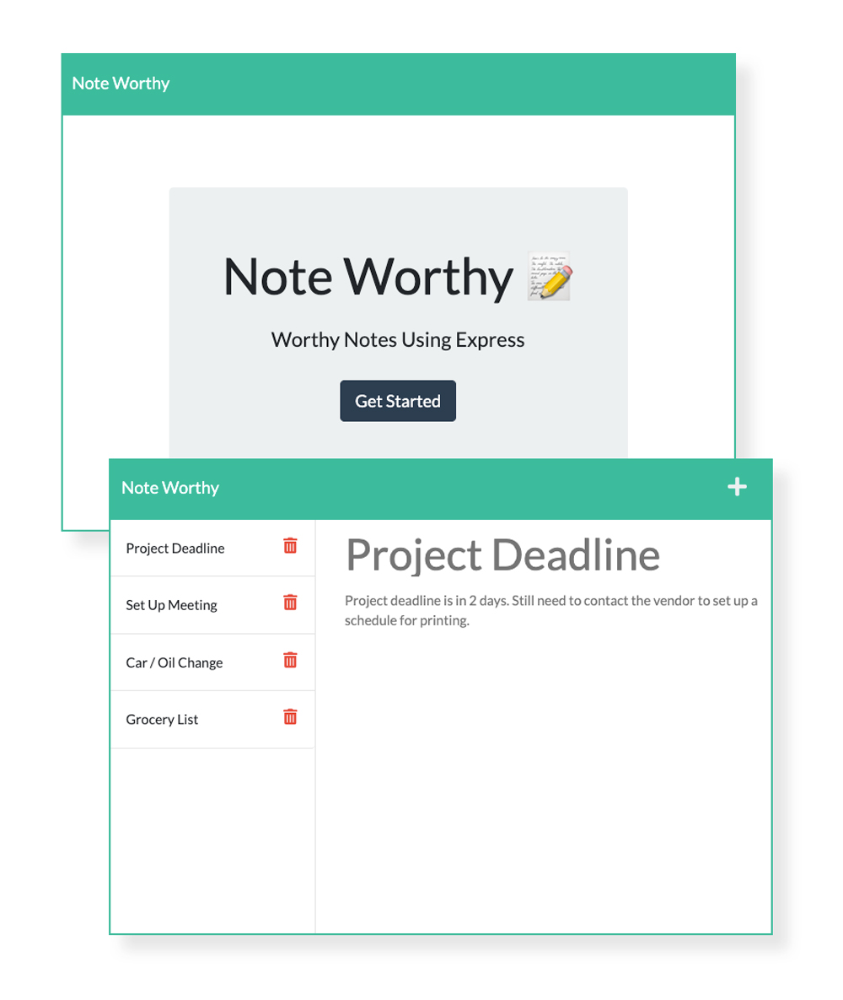

# Note-Worthy App
## An easy to use note taking app worth your time!

## Purpose:
The Note Worthy app helps users stay on top of tasks by entering a title with a text note then clicking the floppy disc in the upper right hand corner to save it to their list! Once the user has completed the task, they can delete the task by clicking the trashcan icon to the right of the note.
To launch the app, simply click the link below then click the "Get Started" button on the landing page! 

## Live Heroku App URL:
## https://dronet-note-worthy-app.herokuapp.com/

 

     

 

## This Website Created Using:
* HTML 
* CSS
* JavaScript
* NodeJS 
* Express
* Bootstrap
* GitHub
* Heroku

## Contribute:
### Please contact me regarding contributing to this repository. All additions must be approved.

## Questions?
### *If you have any questions here's how to contact me:*
* Username: DronetDevDesign
* Repository: https://github.com/DronetDevDesign
* Email: ron@DronetDevDesign.com
